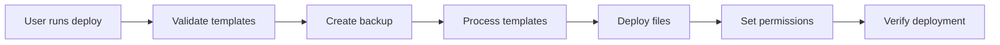

# Configuration Management

Gohan provides a powerful configuration management system that handles deployment, templating, and versioning of your Hyprland environment configurations.

## Overview

The configuration system manages files for:

- **Hyprland** - Core compositor configuration
- **Waybar** - Status bar configuration and styling
- **Kitty** - Terminal emulator settings
- **Rofi** - Application launcher
- **Fuzzel** - Alternative launcher
- **Mako** - Notification daemon
- **Alacritty** - Alternative terminal

## Quick Start

```bash
# Deploy all configurations
gohan config deploy

# Deploy specific components
gohan config deploy --components hyprland,waybar

# Preview what will be deployed
gohan config deploy --dry-run

# Force deployment without prompts
gohan config deploy --force
```

## Commands

### List Available Components

View all available configuration components:

```bash
gohan config list
```

**Output:**
```
Available Configuration Components:

• hyprland
  Core Hyprland window manager configuration
  Files:
    - ~/.config/hypr/hyprland.conf

• waybar
  Status bar configuration
  Files:
    - ~/.config/waybar/config.jsonc
    - ~/.config/waybar/style.css

• kitty
  Terminal emulator configuration
  Files:
    - ~/.config/kitty/kitty.conf

• fuzzel
  Application launcher configuration
  Files:
    - ~/.config/fuzzel/fuzzel.ini
```

### Deploy Configurations

Deploy configuration files to your system:

```bash
gohan config deploy [flags]
```

**Flags:**

| Flag | Description | Default |
|------|-------------|---------|
| `--components` | Components to deploy (comma-separated) | all |
| `--dry-run` | Preview deployment without making changes | false |
| `--force` | Force deployment without prompting | false |
| `--skip-backup` | Skip backup of existing configurations | false |
| `--progress` | Show progress during deployment | false |

**Examples:**

```bash
# Deploy all configurations with progress
gohan config deploy --progress

# Deploy only Hyprland and Waybar
gohan config deploy --components hyprland,waybar

# Preview deployment
gohan config deploy --dry-run

# Force deployment (no prompts)
gohan config deploy --force

# Deploy without creating backups
gohan config deploy --skip-backup
```

## Template System

Gohan uses a template-based configuration system that automatically injects:

- **User variables** (username, home directory)
- **Theme colors** (from active theme)
- **System information** (hostname, etc.)

### Template Variables

Templates use `{{variable}}` syntax for substitution:

**User Variables:**
```
{{username}}   - Current username
{{home}}       - Home directory path
{{home_dir}}   - Home directory path (alias)
{{config_dir}} - .config directory path
```

**Theme Variables:**
```
{{theme_name}}         - Theme identifier (e.g., "mocha")
{{theme_display_name}} - Human-readable name (e.g., "Catppuccin Mocha")
{{theme_variant}}      - Light or dark
{{theme_base}}         - Background color
{{theme_surface}}      - Surface color
{{theme_overlay}}      - Overlay color
{{theme_text}}         - Text color
{{theme_subtext}}      - Subtext color
```

**Catppuccin Color Palette:**
```
{{theme_rosewater}}
{{theme_flamingo}}
{{theme_pink}}
{{theme_mauve}}
{{theme_red}}
{{theme_maroon}}
{{theme_peach}}
{{theme_yellow}}
{{theme_green}}
{{theme_teal}}
{{theme_sky}}
{{theme_sapphire}}
{{theme_blue}}
{{theme_lavender}}
```

### Example Template

**Hyprland configuration template** (`templates/hyprland/hyprland.conf.tmpl`):

```conf
# Gohan Configuration for {{username}}
# Theme: {{theme_display_name}}
# Generated: {{timestamp}}

# Window rules
general {
    gaps_in = 5
    gaps_out = 10
    border_size = 2
    col.active_border = rgb({{theme_mauve}})
    col.inactive_border = rgb({{theme_surface}})
}

# Background
decoration {
    rounding = 10

    blur {
        enabled = true
        size = 8
    }

    drop_shadow = yes
    shadow_range = 4
    shadow_render_power = 3
    col.shadow = rgba({{theme_base}}ee)
}

# Colors
misc {
    background_color = rgb({{theme_base}})
}
```

**After deployment** (with Mocha theme):

```conf
# Gohan Configuration for alice
# Theme: Catppuccin Mocha
# Generated: 2024-10-30T12:00:00Z

# Window rules
general {
    gaps_in = 5
    gaps_out = 10
    border_size = 2
    col.active_border = rgb(cba6f7)
    col.inactive_border = rgb(313244)
}

# Background
decoration {
    rounding = 10

    blur {
        enabled = true
        size = 8
    }

    drop_shadow = yes
    shadow_range = 4
    shadow_render_power = 3
    col.shadow = rgba(1e1e2eee)
}

# Colors
misc {
    background_color = rgb(1e1e2e)
}
```

## Deployment Process

When you run `gohan config deploy`, the following happens:

1. **Validation** - Checks that template files exist
2. **Backup** - Creates timestamped backup of existing configs
3. **Template Processing** - Substitutes variables with actual values
4. **File Deployment** - Writes processed configs to target locations
5. **Permission Setting** - Sets correct file permissions (0644)
6. **Verification** - Confirms successful deployment

### Deployment Flow



## Backup Integration

All deployments automatically create backups:

```bash
# Deployment creates backup
gohan config deploy

📦 Backup Created:
   ID:   20241030_120000
   Path: ~/.local/share/gohan/backups/20241030_120000

# List backups
gohan backup list

# Restore if needed
gohan backup restore 20241030_120000
```

See [Backup & Restore](backup-restore.md) for full backup documentation.

## Directory Structure

Gohan manages configurations in standard XDG locations:

```
~/.config/
├── hypr/
│   └── hyprland.conf
├── waybar/
│   ├── config.jsonc
│   └── style.css
├── kitty/
│   └── kitty.conf
├── rofi/
│   └── config.rasi
├── fuzzel/
│   └── fuzzel.ini
├── mako/
│   └── config
└── alacritty/
    └── alacritty.yml
```

**Backup location:**
```
~/.local/share/gohan/backups/
└── <timestamp>/
    └── .config/
        └── [backed up files]
```

## Configuration Components

### Hyprland

**Files:**
- `~/.config/hypr/hyprland.conf`

**Template variables used:**
- Window border colors (`theme_mauve`, `theme_surface`)
- Background colors (`theme_base`)
- User information (`username`, `home`)

**Auto-reload:** Yes (via `hyprctl reload`)

### Waybar

**Files:**
- `~/.config/waybar/config.jsonc` - Bar configuration
- `~/.config/waybar/style.css` - Styling and colors

**Template variables used:**
- All theme colors for bar styling
- Module configurations

**Auto-reload:** Yes (automatic restart)

### Kitty

**Files:**
- `~/.config/kitty/kitty.conf`

**Template variables used:**
- Terminal colors (all 16 Catppuccin colors)
- Font settings
- Background opacity

**Auto-reload:** Yes (via `kill -SIGUSR1`)

### Fuzzel

**Files:**
- `~/.config/fuzzel/fuzzel.ini`

**Template variables used:**
- Window colors
- Font settings
- Border colors

**Auto-reload:** No (restart required)

## Troubleshooting

### Templates Not Found

**Problem:** `Error: template file not found`

**Solution:**
```bash
# Verify template files exist
ls -la templates/

# Reinstall templates if missing
git pull origin main
```

### Permission Denied

**Problem:** `Error: permission denied writing to ~/.config`

**Solution:**
```bash
# Check file permissions
ls -la ~/.config/hypr/

# Fix permissions
chmod 644 ~/.config/hypr/hyprland.conf
chmod 755 ~/.config/hypr/
```

### Variables Not Substituted

**Problem:** Config file still contains `{{theme_base}}`

**Solution:**
```bash
# Check theme is set
gohan theme show

# Set a theme if none is active
gohan theme set mocha

# Redeploy configurations
gohan config deploy --force
```

### Backup Failed

**Problem:** `Error: failed to create backup`

**Solution:**
```bash
# Check backup directory exists
mkdir -p ~/.local/share/gohan/backups

# Check disk space
df -h ~

# Deploy without backup (use with caution!)
gohan config deploy --skip-backup
```

## Best Practices

### 1. Always Use Dry-Run First

Preview changes before applying:

```bash
gohan config deploy --dry-run
```

### 2. Create Manual Backups

Before major changes:

```bash
gohan backup create
gohan config deploy
```

### 3. Selective Deployment

Only deploy what you need:

```bash
# Just update Waybar styling
gohan config deploy --components waybar

# Update terminal configs only
gohan config deploy --components kitty,alacritty
```

### 4. Version Control Your Customizations

If you modify templates:

```bash
# Fork templates to personal repository
git remote add personal https://github.com/you/gohan-templates

# Track your changes
git commit -am "Custom Hyprland window rules"
git push personal main
```

### 5. Test After Deployment

Verify everything works:

```bash
# Deploy
gohan config deploy

# Check Hyprland config syntax
hyprctl reload

# Verify Waybar
pkill waybar && waybar &

# Run health check
gohan doctor
```

## Advanced Usage

### Custom Template Variables

You can inject custom variables during deployment:

```bash
# Not yet implemented - coming soon!
gohan config deploy --var monitor="DP-1" --var refresh_rate="144"
```

### Template Inheritance

Templates can include other templates:

```bash
# Not yet implemented - coming soon!
# templates/hyprland/hyprland.conf.tmpl
{{include "hyprland/bindings.conf"}}
{{include "hyprland/monitors.conf"}}
```

## Related Documentation

- [Theme Management](theme-management.md) - Theme switching and colors
- [Backup & Restore](backup-restore.md) - Backup management
- [Troubleshooting](troubleshooting.md) - Common issues
- [CLI Reference](cli-reference.md) - All commands
